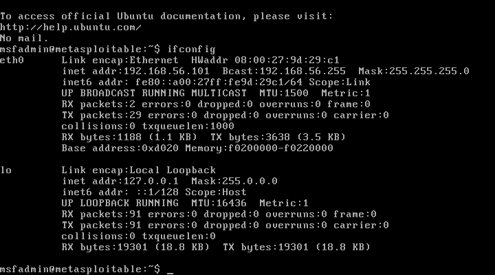
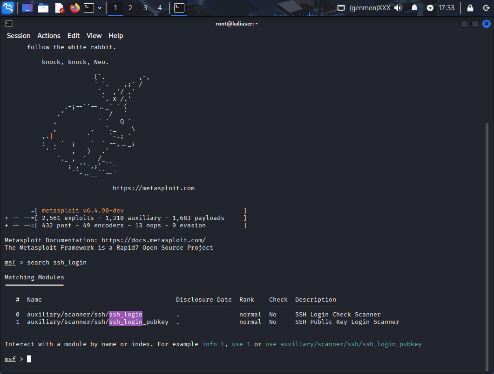
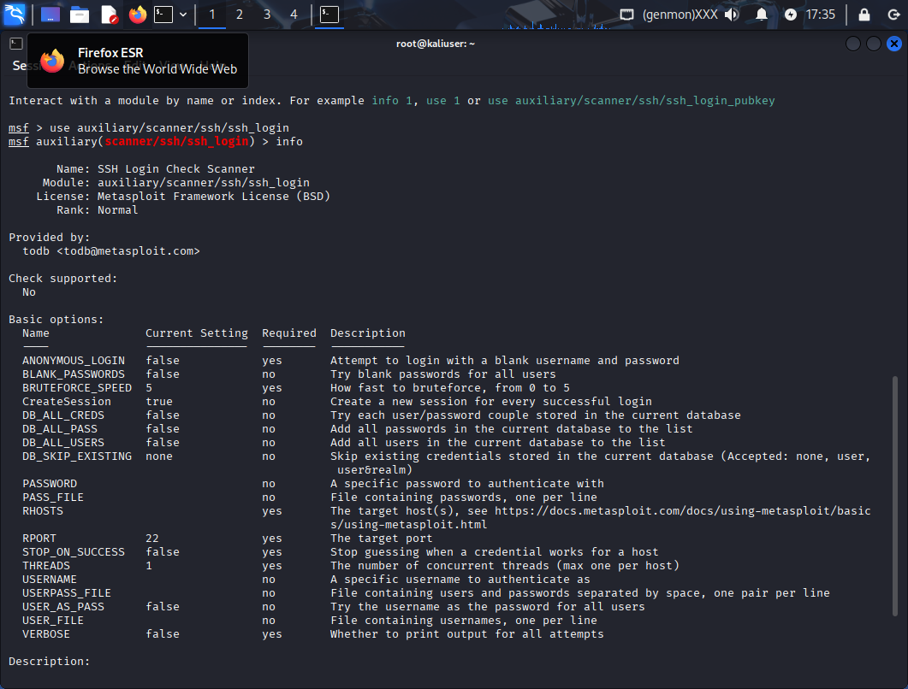
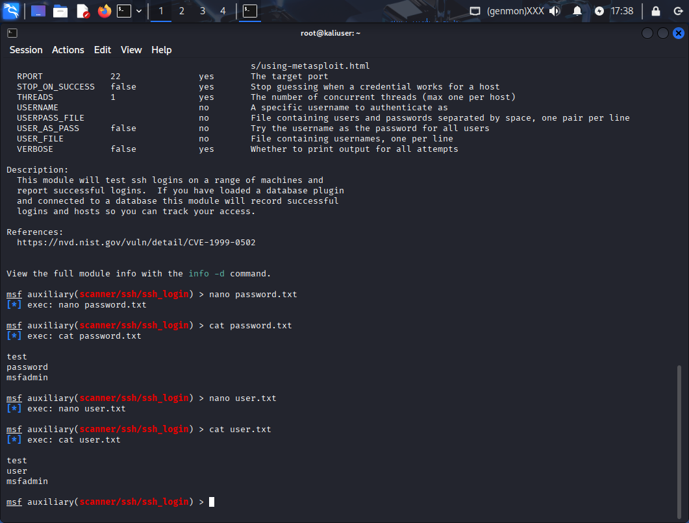
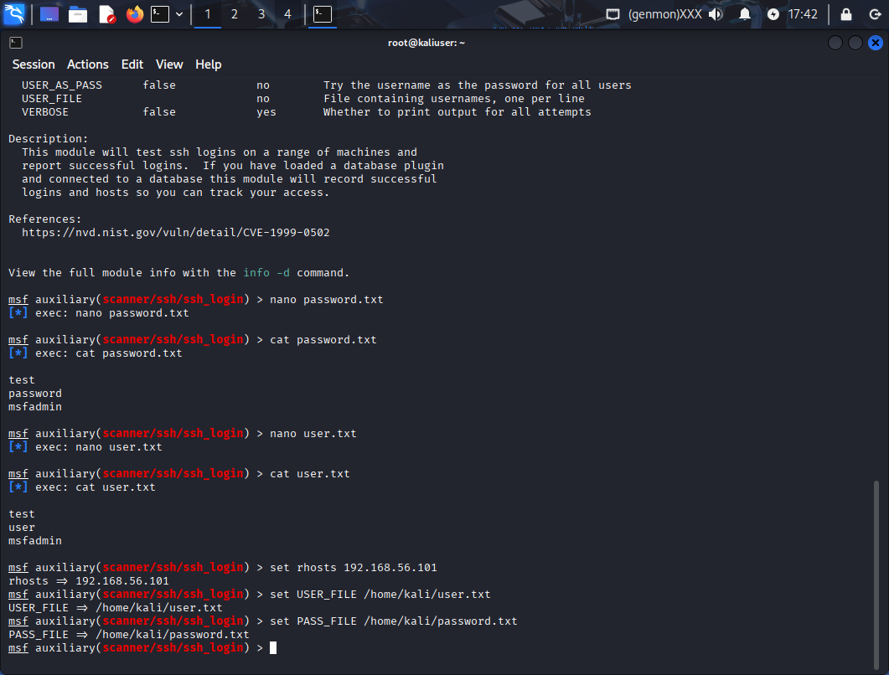
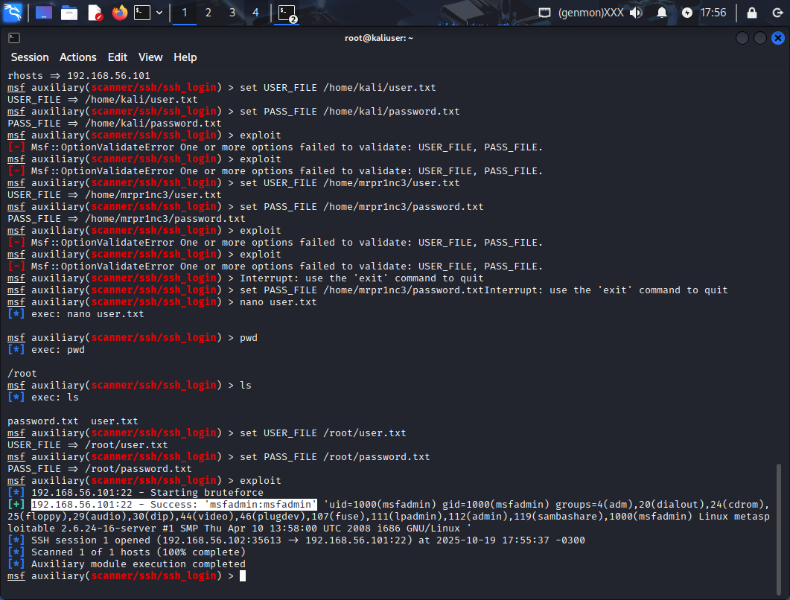
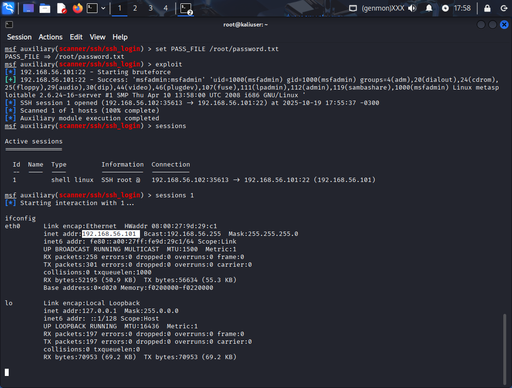

# ataque-ao-SSH
Explorando falhas do SSH usando o Bruteforce do Metasploit

 

IP do alvo

 

Procurando Exploits para ataque no login SSH

 

Oque o Exploit precisa para ser usado

 

Criando arquivos para o ataque de Bruteforce

 

Enviando as informacoes para o Exploit

 

Usuario e senha descoberto

 

Dentro da maquina alvo 
